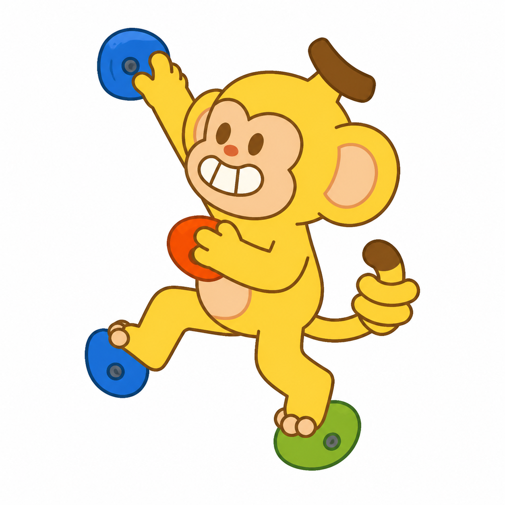
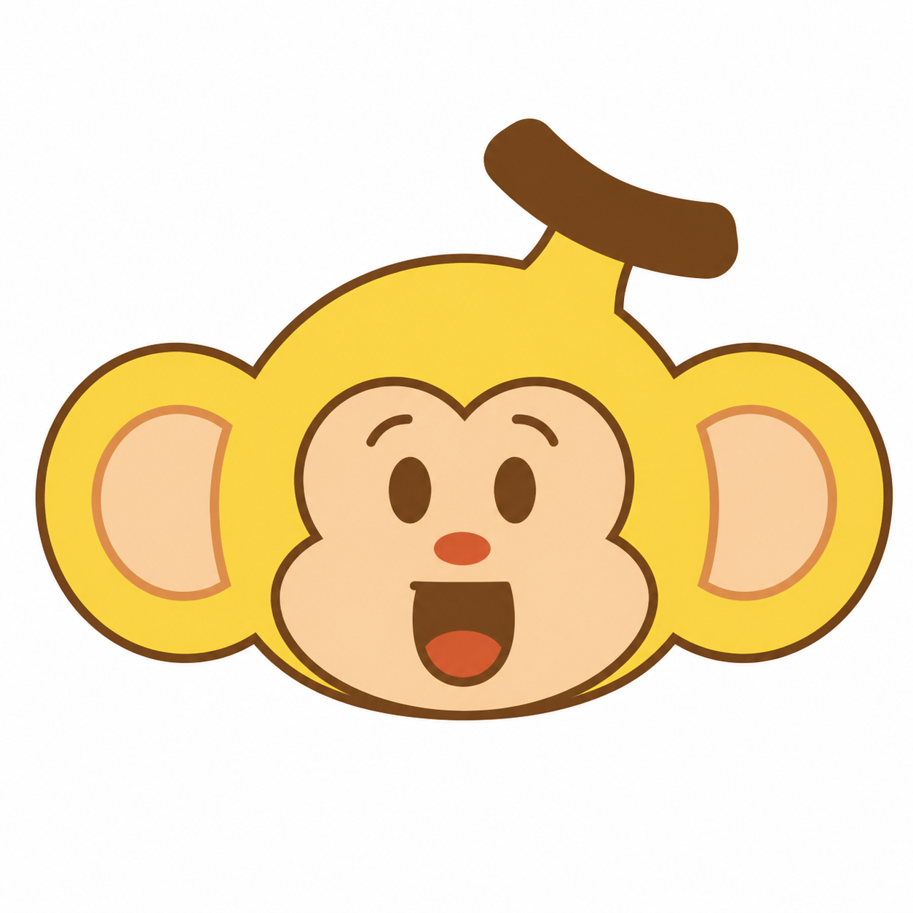

# Balala Skill

为香蕉攀岩吉祥物 Balala 生成品牌一致的白底图与真透明 PNG 素材。

安装后，只需描述 Balala 正在做什么。Skill 会自动选择：

- 2D 全身版：动作、运动、贴纸和教学插画
- 2D 头像版：表情、头像、反应和小图标
- 3D 全身版：品牌主视觉、公仔感和宣传渲染

所有版本都内置官方角色参考图。2D 四视图与 3D 三视图拥有最高几何优先级；3D 的尾巴末端和头顶香蕉柄以最新三视图为准。

默认一次交付两张姿势、构图和道具完全一致的 PNG：

- `balala-white.png`：纯白底预览版，方便审核、分享和直接用于白色版面
- `balala-transparent.png`：带真实 Alpha 通道的免抠图素材版，方便海报、网页、周边和视频合成

如果用户明确说“只要透明底”或“只要白底”，Skill 只输出指定版本。

## 效果预览

| 2D 全身 | 2D 头像 | 3D 全身 |
|---|---|---|
|  |  |  |

## 推荐安装方式

在 Codex 中发送：

```text
Use $skill-installer to install the skill from https://github.com/bananaclimbingmops-sketch/balala/tree/main/balala
```

安装完成后，Skill 名称为 `balala`。

## 手动安装

```bash
git clone https://github.com/bananaclimbingmops-sketch/balala.git
mkdir -p ~/.agents/skills
cp -R balala/balala ~/.agents/skills/balala
```

也可以下载仓库根目录的 `balala.skill.zip`，将其中的 `balala` 文件夹解压到：

```text
~/.agents/skills/balala
```

Codex 没有立即显示新 Skill 时，重新启动 Codex。

## 使用

ChatGPT 桌面端启用 Skill 后，它会出现在 `/` 命令列表中：

```text
/balala
```

在 Codex CLI、IDE 扩展或需要跨客户端兼容时，使用官方的显式 Skill 调用写法：

```text
$balala 生成一个正在攀岩的 Balala
```

也可以自然描述，由 Agent 根据 Skill 描述自动调用：

```text
生成一个正在使用电脑的 Balala。
```

默认返回白底版和透明底版。也可以指定：

```text
$balala 生成一个正在使用电脑的 3D Balala，只要透明底 PNG。
```

## 依赖

使用端需要具备支持本地参考图片的图片生成或图片编辑能力。Skill 本身不包含图片模型或 API 凭据。

## 内容

- `balala/SKILL.md`：执行流程、模式路由与双输出规则
- `balala/assets/`：23 张角色、动作、表情与转面参考图
- `balala/references/`：角色规范、模式路由与提示词模板
- `balala/scripts/make_transparent.py`：仅移除边缘连通的近白背景，保护牙齿、短裤等内部浅色细节
- `balala/scripts/validate_output.py`：白底/透明底、Alpha、尺寸和安全边距检查

## 官方调用说明

OpenAI 文档说明：桌面端启用的 Skills 会显示在 `/` 命令列表中；Codex CLI 和 IDE 扩展通过 `$` 显式提及 Skill。不同客户端的界面可能不同，因此 `$balala` 是更通用的显式写法。
